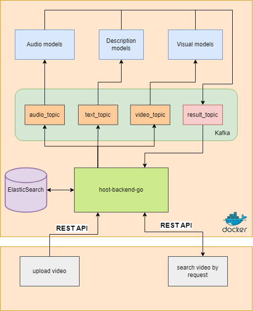

# Сервис текстового поиска по медиаконтенту

Cервис, позволяющий индексировать и осуществлять поиск по видео на основе медиаконтента в рамках Хакатона `Лидеры цифровой трансформации 2024`

# Актуальность
В библиотеке Yappy десятки миллионов коротких видео. Возможность быстро и эффективно находить интересующий контент улучшает пользовательский опыт, помогает найти новые интересы пользователя и улучшить рекомендации.

# Описание задачи
Разработайте сервис, позволяющий индексировать и осуществлять поиск по видео на основе медиаконтента. Сервис должен уметь обрабатывать запросы пользователей, извлекать из них ключевые слова и на их основе осуществлять поиск релевантных видеофайлов

# Стек технологий

- Python3
- Golang
- Kafka
- ElasticSearch
- Docker compose

# Архитектура

# Команда:

- *Капитан, DevOps* - [Никита](https://github.com/skpntsv)
- *Machine Learning инженер* - [Данил](https://github.com/UsusCimex)
- *Back-end разбработчик* - [Людмила](https://github.com/liudaponel)